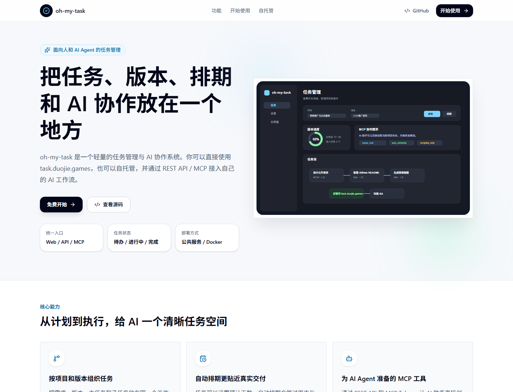
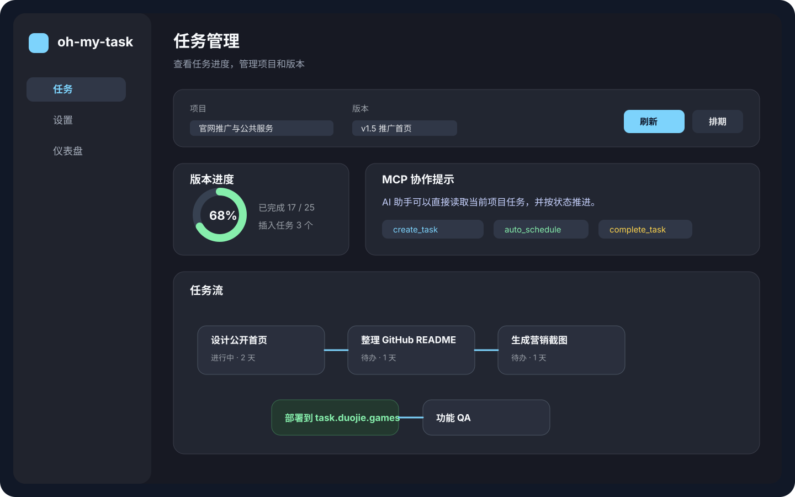
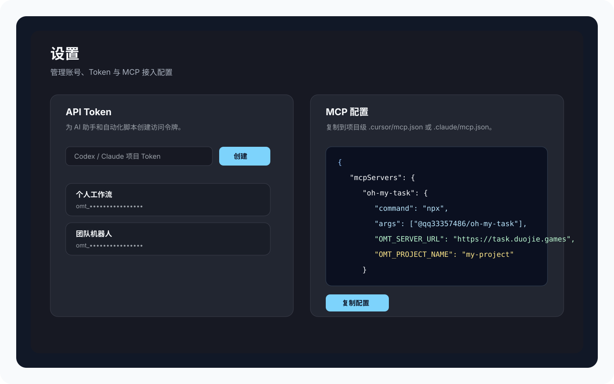

# oh-my-task

面向个人、小团队和 AI Agent 的轻量任务管理系统。用一个统一入口管理项目、版本、任务、排期、REST API 和 MCP 协作。

**公共服务**：[https://task.duojie.games](https://task.duojie.games)<br>
**自托管**：Docker 一条命令启动，数据保存在你自己的 SQLite 文件中。



## 为什么使用 oh-my-task

- **适合真实项目推进**：按项目、版本、主任务、子任务组织工作，不只是普通 TODO。
- **版本生命周期清晰**：创建 → 启动/锁定 → 完成 → 归档，适合阶段性交付。
- **智能排期**：根据预计天数自动计算排期，并跳过周末和中国法定节假日。
- **AI 协作友好**：提供 REST API 和 MCP 工具，AI 助手可以直接创建、查询、推进和完成任务。
- **公共服务与自托管并存**：可以直接使用 `task.duojie.games`，也可以部署到自己的服务器。
- **权限与后台**：支持 Session 登录、Bearer Token、用户管理、系统配置和统计面板。

## 直接使用公共服务

1. 打开 [task.duojie.games](https://task.duojie.games)。
2. 注册账号并创建项目。
3. 创建版本和任务，或在设置页创建 Token 后接入 MCP。

公共服务适合快速开始、个人项目和轻量团队协作。如果你需要完全掌控数据，可以使用下面的 Docker 自托管方式。

## 页面预览





## Docker 自托管

一条命令启动：

```bash
docker run -d --name oh-my-task \
  -p 17173:17173 \
  -v oh-my-task-data:/app/data \
  ghcr.io/qq33357486/oh-my-task:latest
```

使用 `docker-compose.yml`：

```yaml
services:
  oh-my-task:
    image: ghcr.io/qq33357486/oh-my-task:latest
    container_name: oh-my-task
    ports:
      - "17173:17173"
    volumes:
      - ./data:/app/data
    environment:
      - NODE_ENV=production
      - DB_PATH=/app/data/data.db
    restart: unless-stopped
```

```bash
docker compose up -d
```

访问 `http://localhost:17173` 打开 Web 界面。空库初始化时，首位注册用户会自动成为管理员。

## 本地开发

```bash
# 安装依赖
npm install
cd web && npm install && cd ..

# 构建后端和前端
npm run build
cd web && npm run build && cd ..

# 启动统一服务
WEB_DIST_PATH=web/dist API_PORT=17173 npm start
```

PowerShell：

```powershell
$env:WEB_DIST_PATH = "web/dist"; $env:API_PORT = "17173"; npm start
```

开发时也可以分别启动后端和 Vite：

```bash
npm run dev
cd web && npm run dev
```

Vite 的 `http://localhost:5173` 仅用于前端热更新调试；正式入口、Docker 和功能 QA 都使用统一端口 `17173`。

## 配置 MCP

在 Web 设置页创建 Token：右上角 → 设置 → 创建 Token。

oh-my-task 通过**项目名称**区分不同任务空间，推荐把 MCP 配置放在项目级文件中，例如 `.cursor/mcp.json` 或 `.claude/mcp.json`。

```json
{
  "mcpServers": {
    "oh-my-task": {
      "command": "npx",
      "args": ["@qq33357486/oh-my-task"],
      "env": {
        "OMT_SERVER_URL": "https://task.duojie.games",
        "OMT_TOKEN": "你的 Token",
        "OMT_PROJECT_NAME": "当前项目名称"
      }
    }
  }
}
```

如果使用本地 Docker 服务，把 `OMT_SERVER_URL` 改为：

```text
http://localhost:17173
```

### MCP 工具

| 工具 | 说明 |
| --- | --- |
| `init_project` | 初始化项目 |
| `create_task` | 创建任务 |
| `list_tasks` | 列出任务 |
| `get_task` | 获取任务详情 |
| `activate_task` | 开始任务 |
| `complete_task` | 完成任务 |
| `delete_task` | 删除任务 |
| `create_version` | 创建版本 |
| `list_versions` | 列出版本 |
| `get_current_task` | 获取当前进行中的主任务及子任务 |
| `auto_schedule` | 自动排期并跳过节假日 |

## 常见使用方式

创建版本：

```text
创建版本 v1.0：用户系统
```

批量创建任务：

```text
在 v1.0 下批量创建任务：
- 用户登录
  - 登录表单
  - 登录 API
- 商品列表
  - 列表页面
```

推进任务：

```text
开始做「用户登录功能」
「用户登录功能」做完了
当前在做什么？
```

自动排期：

```text
给 v1.0 的任务自动排期，从下周一开始
```

## 环境变量

| 变量 | 说明 | 默认值 |
| --- | --- | --- |
| `API_PORT` | Web/API 统一服务端口 | `17173` |
| `DB_PATH` | SQLite 数据库路径 | `./data/data.db` |
| `WEB_DIST_PATH` | 前端构建产物目录 | `web/dist` |
| `FRONTEND_URL` | Vite 调试模式 CORS origin | `http://localhost:5173` |
| `SESSION_SECRET` | Session 密钥 | `omt-session-secret-change-in-production` |
| `OMT_SERVER_URL` | MCP/API 服务地址 | `http://localhost:17173` |
| `OMT_TOKEN` | MCP Bearer Token | 空 |
| `OMT_PROJECT_NAME` | MCP 默认项目名称 | 空 |

## 技术栈

- 后端：Express.js + TypeScript + SQLite
- 前端：React 19 + Vite + TanStack Query + Tailwind CSS 4
- AI 协作：REST API + MCP stdio server
- 部署：Docker / Node.js 统一服务入口

## 链接

- 公共服务：[https://task.duojie.games](https://task.duojie.games)
- 英文版：[README_EN.md](README_EN.md)
- GitHub：[https://github.com/qq33357486/oh-my-task](https://github.com/qq33357486/oh-my-task)
